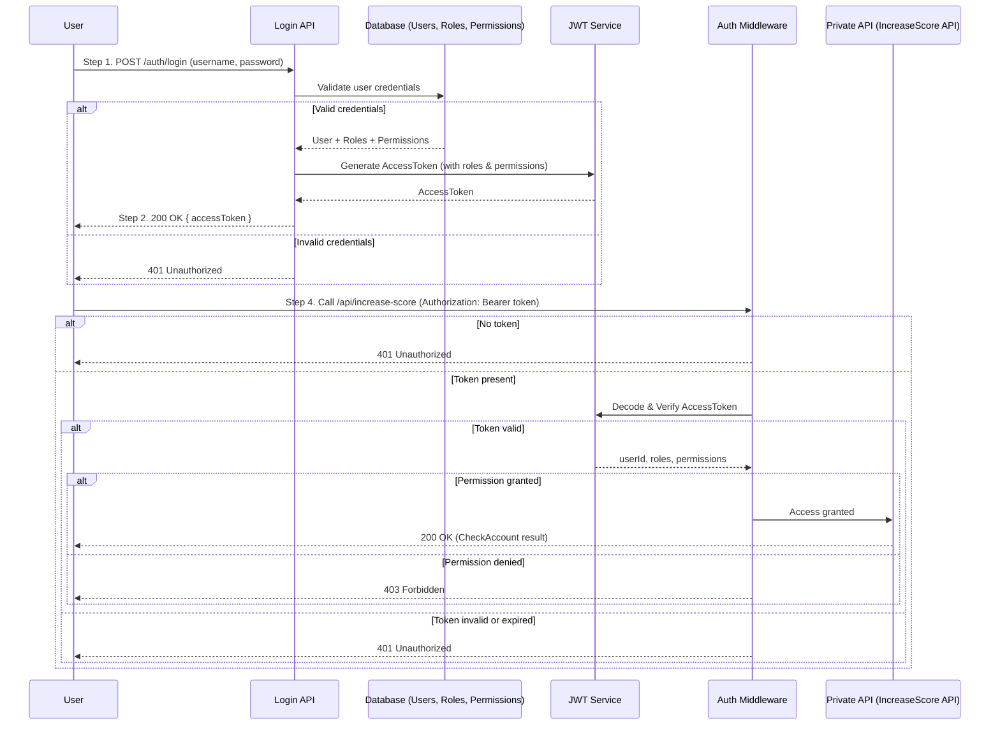

# code-challenge-001

## Github Repository

```bash
git clone https://github.com/nguyentan1813/code-challenge-001.git
cd code-challenge-001
```

## Structure Folder Project

```
src/
|-- problem4/
index.ts # Functions process for task 4
|-- problem5/
│ |-- config/ # App configs (swagger, db, etc.)
│ |-- define/ # Constants, enums
│ |-- dtos/ # Request/response DTOs
│ |-- helpers/ # Utilities
│ |-- middlewares/ # Middlewares (validation, logging)
│ |-- models/ # TypeORM entities
│ |-- presentation/ # Controllers
│ |-- repositories/ # DB repositories
│ |-- routes/ # API routes
│ |-- usecases/ # Business logic
|-- app.ts # Express app
|-- server.ts # Server bootstrap
|-- Dockerfile
|-- .env.sample #List environtment varibles for application
docker-compose.yaml
```

## Prerequisites

- [Node.js v22+](https://nodejs.org/)
- [npm](https://www.npmjs.com/)
- [Docker](https://docs.docker.com/get-docker/)
- [Docker Compose](https://docs.docker.com/compose/)

---

## Install Dependencies

When you get project from github and installed prerequisites. You can open project with the VSCode Editor then run command below in the terminal

```
npm install
```

# Problem 4: Functions defined to complete the task

```
Try to test with command:
npm run problem4
```

# Problem 5: Resource Management APIs

A simple **Node.js + Express + TypeORM + PostgreSQL** CRUD API with Swagger documentation.

---

### Features

- CRUD Resource API (`/api/resources`)
- Input validation (class-validator + DTOs)
- Swagger UI (`/swagger`)
- Postgres integration
- Docker & Docker Compose support

---

### Run For Test Via Docker Compose

- You can run to quick test by docker-compose. It will run Postgres and Build and Run the API Application

```
docker-compose up -d
```

- Then you access via link:

```
http://localhost:4000/swagger
```

- You can access the PosgresDB with the information

```
POSTGRES_USER: developer
POSTGRES_PASSWORD: codechallenge
POSTGRES_DB: resource_management
PORT: 5423 -- Avoid conflict port on machine installed Postgres
HOST: localhost
```

- Clean resources installed after test

```
docker-compose down -v
```

---

### If You Want To Run Directly On The Editor Such As VSCode

- You change the value in .env which matching on your local machine

- Run without build with the command:

```
npm run problem5
```

- Run after build

```
npm run build
npm run start
```

---

# Problem 6: Architecture

### Software Requirements

1. We have a website with a score board, which shows the top 10 user’s scores.
2. We want live update of the score board.
3. User can do an action (which we do not need to care what the action is), completing this action will increase the user’s score.
4. Upon completion the action will dispatch an API call to the application server to update the score.
5. We want to prevent malicious users from increasing scores without authorisation.

### Idea for Solution

We need to develop the Authenticate And Authorize features.
When requests access to the Apis need to protected, the system will check user must be authenticated and the user have permission valid to react on Apis.

For enhance security:
The system only process for accept requests from Accepted Domains: Can create accept list domain and system will check request sent from one of the accept list domain.

### Implement Idea For Authenticate and Authorize Checking


#### Step 1: Organize Database Structure

- [DrawFile: Database ERD](src/problem6/Problem6.drawio)


#### Step 2: Implement application flows

## Authenticate & Authorize Flow


